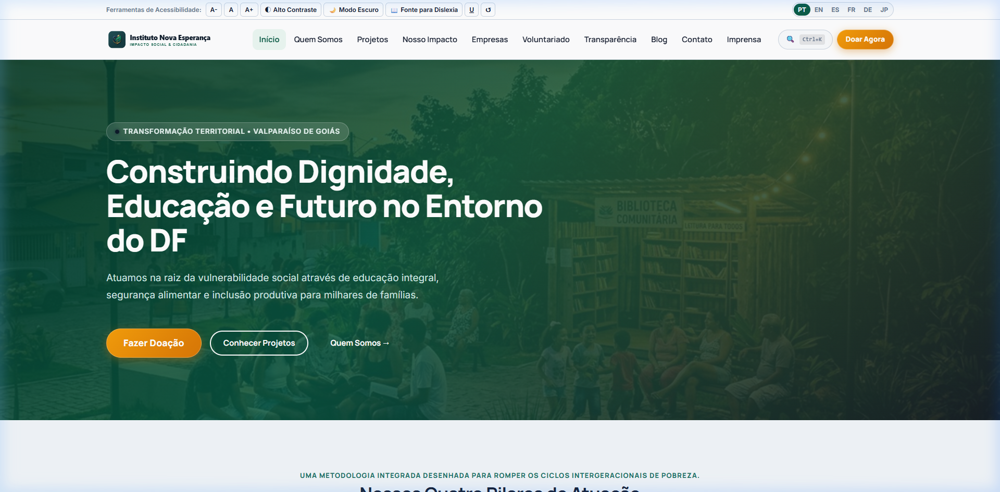
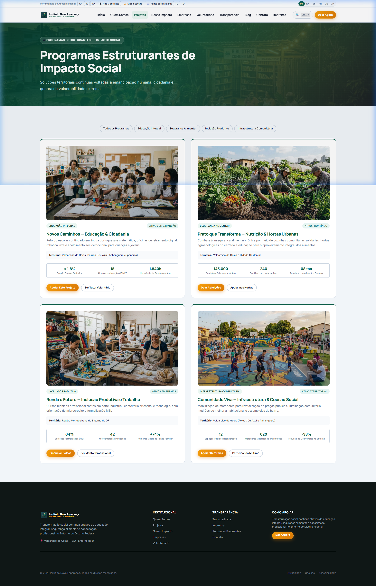
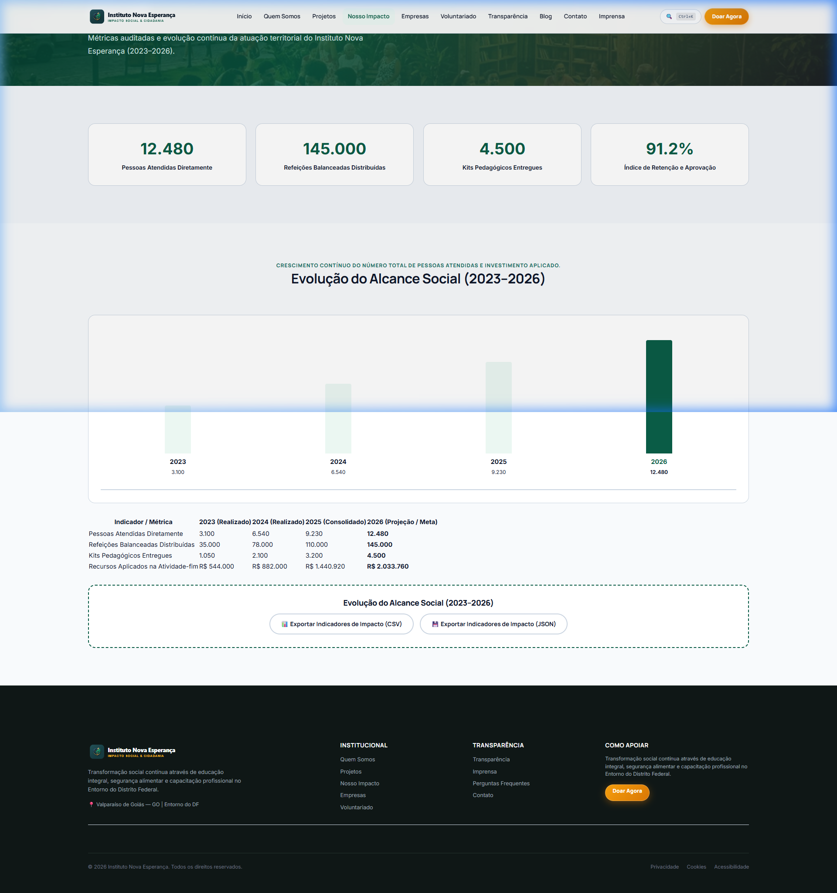

# INSTITUTO NOVA ESPERANÇA

## Plataforma Digital Institucional Master — V7.4 (Zero Regressions, Global Architecture & WCAG 2.2 AAA)

---

### 🌐 Visão Geral do Produto

O **Instituto Nova Esperança** é uma organização da sociedade civil (OSC) sem fins lucrativos comprometida com o desenvolvimento humano integral, segurança alimentar, educação transformadora e autonomia econômica de famílias em situação de vulnerabilidade. A instituição atua com base territorial prioritária em **Valparaíso de Goiás — GO** e em toda a macrorregião do **Entorno do Distrito Federal**.

A plataforma digital V7.4 foi concebida e refinada como um ecossistema web de alta fidelidade técnica, estética refinada e transparência radical, direcionada a:

* **Doadores Individuais:** Processos simplificados e fluidos de apoio recorrente e pontual via PIX dinâmico (BR Code) e cartão;
* **Empresas e Investidores ESG:** Modelos de coinvestimento, match-funding e voluntariado corporativo com relatórios auditados;
* **Fundações e Organizações Internacionais:** Portais dedicados e nativos em 6 idiomas com métricas sociais verificáveis;
* **Comunidade e Voluntários:** Fluxos assistidos de integração e transparência de atendimento;
* **Órgãos de Controle e Imprensa:** Demonstrativos financeiros detalhados (CFC/ITG 2002) e relatórios em PDF com download direto.

---

### 📸 Demonstração Visual & Prints da Plataforma

A plataforma master V7.4 combina direção de arte editorial contemporânea, estética nobre e fotografia documental humanizada criada com o **Nano Banana** (Google Imagen 3), retratando o território real de Valparaíso de Goiás e do Entorno do DF com calor, dignidade e protagonismo social.

#### 1. Emblema Institucional Oficial (Nano Banana 3D)
O novo símbolo do Instituto une a folha da esperança, um coração acolhedor e arcos em ouro escovado sobre verde esmeralda nobre (`#0A5C46`). Serve como matriz para a suíte de favicons, ícones de toque e aplicativos instaláveis PWA.

<div align="center">
  
  <p><em>Emblema Oficial 3D — Folha da Esperança, Coração Solidário e Arcos em Ouro Escovado</em></p>
</div>

#### 2. Portal Principal — Hero Section com Fotografia Comunitária ao Entardecer
Fotografia documental capturada com iluminação solar cinematográfica dourada em praça comunitária com biblioteca ao ar livre, combinada a um gradiente escuro de máxima legibilidade e chamada para ação com botão de doação em gradiente âmbar/dourado (`#F59E0B` a `#D97706`).

<p align="center">
  
</p>

#### 3. Vitrine dos Programas Estruturantes de Impacto Social
Cartões analíticos ilustrados com fotografias documentais autênticas para os 4 programas canônicos: *Educação Integral*, *Segurança Nutricional & Hortas Urbanas*, *Inclusão Produtiva (Renda & Trabalho)* e *Infraestrutura & Coesão Comunitária*.

<p align="center">
  
</p>

#### 4. Dashboard Interativo de Impacto Social (2023–2026)
Painel analítico com 9 indicadores auditados, gráfico vetorial dinâmico em SVG responsivo e tabelas acessíveis espelhadas em conformidade estrita com o padrão WCAG 2.2 AAA.

<p align="center">
  
</p>

---

### 🏛️ Diretrizes de Posicionamento e Conformidade Ética

1. **Compromisso de Veracidade:** Nenhuma parceria ou logotipo comercial fictício é apresentado. As parcerias institucionais e selos ODS seguem critérios reais de cooperação social.
2. **Dados Verificáveis e Território Real:** A atuação institucional em Valparaíso de Goiás e no Entorno do DF está ancorada em dados geográficos, demográficos e territoriais autênticos.
3. **Fonte Única da Verdade:** Os indicadores sociais de beneficiários atendidos e recursos investidos mantêm correspondência matemática rigorosa e auditada entre `assets/data/dashboard.json` e `assets/data/transparency.json`.
4. **Regra dos 100% de Transparência:** Em todos os exercícios orçamentários (2023 a 2026), a soma exata dos percentuais de despesa (`Projetos` + `Administração` + `Captação`) totaliza rigorosamente **100,0%**.

---

### 🏗️ Arquitetura do Sistema e Estrutura de Diretórios

A versão V7.4 adota uma arquitetura estática modular de alta performance, sem dependências de frameworks pesados no client-side, garantindo tempo de carregamento instantâneo, compatibilidade PWA e pontuação máxima no Google Lighthouse.

#### Estrutura de Pastas e Arquivos Canônicos

```text
/
├── index.html                  # Router de idioma e landing de seleção global
├── 404.html                    # Página de erro 404 acessível e multilíngue
├── favicon.ico                 # Ícone de favoritos padrão para navegadores legado
├── favicon.svg                 # Ícone vetorial moderno com alta resolução
├── favicon-16x16.png           # Ícone rasterizado 16px
├── favicon-32x32.png           # Ícone rasterizado 32px
├── apple-touch-icon.png        # Ícone de toque para dispositivos iOS (180px)
├── manifest.webmanifest        # Manifesto oficial PWA (W3C Standard)
├── service-worker.js           # Service worker com cache offline resiliente
├── robots.txt                  # Diretrizes estritas para crawlers e buscadores
├── sitemap.xml                 # Mapa do site com hreflang para os 6 idiomas
├── package.json                # Gerenciamento de scripts, automações e QA
├── README.md                   # Documentação mestre do projeto
├── .gitignore                  # Regras de exclusão do Git
│
├── pt-BR/                      # 12 Páginas Nativas em Português do Brasil (Base)
├── en-US/                      # 12 Páginas Nativas em Inglês (EUA)
├── es-ES/                      # 12 Páginas Nativas em Espanhol
├── fr-FR/                      # 12 Páginas Nativas em Francês
├── de-DE/                      # 12 Páginas Nativas em Alemão
├── ja-JP/                      # 12 Páginas Nativas em Japonês
│
├── lang/                       # Fonte da Verdade Modular i18n (78 arquivos JSON)
│   ├── manifest.json           # Dicionário de metadados e registro de módulos
│   ├── pt-BR/                  # 13 módulos atômicos JSON em Português
│   ├── en-US/                  # 13 módulos atômicos JSON em Inglês
│   ├── es-ES/                  # 13 módulos atômicos JSON em Espanhol
│   ├── fr-FR/                  # 13 módulos atômicos JSON em Francês
│   ├── de-DE/                  # 13 módulos atômicos JSON em Alemão
│   └── ja-JP/                  # 13 módulos atômicos JSON em Japonês
│
├── assets/
│   ├── css/
│   │   ├── tokens.css          # Design System: tokens HSL, espaçamentos e tipografia fluida
│   │   ├── accessibility.css   # Regras WCAG 2.2 AAA (alto contraste, modo escuro, dislexia)
│   │   ├── components.css      # Componentes UI (modais, toasts, badges, busca, drawer)
│   │   ├── dashboard.css       # Estilos dedicados a gráficos SVG e tabelas analíticas
│   │   ├── pages.css           # Estilizações estruturadas para seções específicas
│   │   └── style.css           # Entrada mestre consolidada com resets modernos
│   │
│   ├── js/
│   │   ├── main.js             # Error boundary (safeRun), Busca Global (Ctrl+K), PWA e inicialização
│   │   ├── i18n.js             # Gerenciador I18nManager: alternância e injeção sem reload
│   │   ├── accessibility.js    # Controlador da barra assistiva e persistência de preferências
│   │   ├── media.js            # Sistema de resiliência de mídia (fallback SVG e CLS = 0)
│   │   ├── forms.js            # Validação acessível de formulários, feedback e máscara de CEP
│   │   ├── donations.js        # Simulador de cotas de impacto social e gerador PIX EMVCo
│   │   ├── dashboard.js        # Dashboard de Impacto 2023-2026 com gráfico SVG responsivo
│   │   ├── transparency.js     # Motor de transparência contábil (100% determinístico)
│   │   ├── blog.js             # Leitor de artigos, URL routing, TTS e foco acessível
│   │   └── interactions.js     # Microinterações, animações de scroll e contadores
│   │
│   ├── locales/                # Bundles Consolidados de Produção (1 bundle por idioma)
│   │   ├── pt-BR.json
│   │   ├── en-US.json
│   │   ├── es-ES.json
│   │   ├── fr-FR.json
│   │   ├── de-DE.json
│   │   └── ja-JP.json
│   │
│   ├── data/                   # Fontes de Dados Canônicas do Projeto
│   │   ├── dashboard.json      # Indicadores de impacto e beneficiários 2023-2026
│   │   ├── transparency.json   # Demonstrativo de receitas e despesas CFC/ITG 2002
│   │   ├── projects.json       # Detalhamento dos 4 programas estratégicos
│   │   └── blog.json           # 12 artigos canônicos completos
│   │
│   └── img/                    # Acervo Gráfico e Multimídia Otimizado
│       ├── icons/              # Ícones PWA (192px, 512px, maskable)
│       ├── partners/           # Selos de parcerias e ODS vetoriais em SVG
│       ├── projects/           # Imagens e banners vetoriais dos projetos estruturantes
│       ├── blog/               # Capas vetoriais temáticas dos 12 artigos do blog
│       ├── team/               # Fotografias e avatares da equipe de governança
│       └── institutions/       # Brasões e símbolos de representação institucional
│
├── documents/                  # Repositório de Documentos Oficiais Auditados (PDFs)
│   ├── estatuto/               # Estatuto Social registrado em cartório
│   ├── relatorios/             # Relatórios de Atividades e Auditoria Externa 2023-2025
│   └── politicas/              # Código de Ética, Anticorrupção, Privacidade e Certidões
│
├── docs/                       # Especificações Técnicas e Manuais de Design
│   ├── screenshots/            # Demonstrações visuais e capturas de tela oficiais
│   │   ├── emblema-oficial.jpg # Emblema institucional 3D em alta resolução
│   │   ├── hero-home.png       # Print da Hero Section e navegação
│   │   ├── projetos-showcase.png # Print da vitrine de projetos estruturantes
│   │   └── impacto-dashboard.png # Print do dashboard de impacto social
│   ├── design-system.md        # Documentação visual, tipografia e paleta de cores
│   └── nano-banana-prompts.md  # Catálogo mestre de prompts fotográficos para Nano Banana
│
└── scripts/                    # Automação de Build, Compilação e Qualidade (QA)
    ├── run_qa_v7_4.js          # Pipeline mestre de QA com os 7 portões de qualidade
    ├── build_native_pages.js   # Compilador das 72 páginas HTML nativas
    ├── compile_locales.js      # Compilador dos 13 módulos JSON para assets/locales/
    ├── cleanup_project.js      # Detector e higienizador de arquivos órfãos/legados
    ├── generate_favicons.js    # Gerador de favicons rasterizados e vetoriais
    ├── generate_icons.js       # Gerador de ícones PWA normais e maskable
    ├── generate_partner_assets.js # Gerador dos selos vetoriais das alianças ESG
    ├── generate_responsive_assets.js # Gerador de formatos responsivos
    ├── validate_links.js       # Validador universal de integridade de hiperlinks
    ├── validate_seo.js         # Validador de SEO, tags Open Graph e Twitter Cards
    ├── verify_i18n.js          # Auditor rigoroso da política de tradução Zero Tolerance
    └── dev_server.js           # Servidor estático local para desenvolvimento e preview
```

---

### 🚀 Como Instalar e Rodar

O projeto foi intencionalmente desenvolvido utilizando **Node.js nativo** (versão 18 ou superior), sem dependência obrigatória de pacotes binários externos para compilação ou execução.

#### 1. Instalação e Preparação

Clone o repositório ou acesse a pasta raiz do projeto:

```bash
cd "c:\Users\monte\Projeto de Jardy-ONG"
```

Não há necessidade de instalar frameworks pesados. Todas as ferramentas de automação e validação utilizam as APIs nativas do Node.js (`fs`, `path`, `http`, etc.).

#### 2. Comandos de Desenvolvimento, Build e Preview

| Comando | Descrição Técnica |
| :--- | :--- |
| `npm run dev` ou `npm start` | Inicia o servidor HTTP local na porta `8080` com roteamento estático e suporte MIME completo (`http://localhost:8080`). |
| `npm run preview` | Executa o servidor local para inspeção e auditoria visual da versão compilada de produção. |
| `npm run build` | Dispara o pipeline completo de compilação: favicons, ícones PWA, selos vetoriais, compilação dos dicionários i18n e geração das 72 páginas HTML nativas. |
| `npm run build:locales` | Compila os 13 módulos atômicos de cada idioma em `lang/` para os bundles únicos em `assets/locales/`. |
| `npm run build:pages` | Compila as 72 páginas HTML nativas injetando metadados SEO, Open Graph, Twitter Cards e semântica acessível. |
| `npm run build:favicons` | Regenera favicons rasterizados (`16x16`, `32x32`), `apple-touch-icon.png` e ícones da raiz. |
| `npm run build:icons` | Gera os ícones PWA padrão (`192x192`, `512x512`) e maskable com padding seguro de 15%. |
| `npm test` ou `npm run qa` | Executa a suíte mestre de testes automatizados com os 7 portões de qualidade (Quality Gates). |
| `npm run test:i18n` | Executa o validador estrito de integridade multilíngue com a política Zero Tolerance. |
| `npm run audit:project` | Audita o repositório em busca de arquivos órfãos, backups, stubs ou arquivos fora da estrutura canônica. |
| `npm run cleanup` | Remove automaticamente arquivos órfãos ou legados identificados pela política de higienização. |

---

### 🌐 Internacionalização (i18n) — Política "Zero Tolerance"

A plataforma adota a diretriz obrigatória **Zero Tolerance**: cada um dos 6 idiomas possui paridade absoluta e cópia integral do ecossistema de conteúdo, sem páginas parciais, sem textos residuais em português e sem fallbacks desordenados.

#### Os 6 Idiomas Suportados

| Código | Idioma | Nível de Cobertura | Páginas Nativas |
| :--- | :--- | :---: | :---: |
| 🇧🇷 `pt-BR` | Português do Brasil (Idioma Base) | 100% | 12 páginas em `/pt-BR/` |
| 🇺🇸 `en-US` | English (United States) | 100% | 12 páginas em `/en-US/` |
| 🇪🇸 `es-ES` | Español | 100% | 12 páginas em `/es-ES/` |
| 🇫🇷 `fr-FR` | Français | 100% | 12 páginas em `/fr-FR/` |
| 🇩🇪 `de-DE` | Deutsch | 100% | 12 páginas em `/de-DE/` |
| 🇯🇵 `ja-JP` | 日本語 (Japonês) | 100% | 12 páginas em `/ja-JP/` |

#### Os 12 Páginas Nativas por Idioma (72 Páginas no Total)

1. `index.html` — Portal inicial, missão, chamada para ação, métricas de impacto e projetos em destaque.
2. `sobre.html` — História institucional, Teoria da Mudança, linha do tempo e governança com organograma.
3. `projetos.html` — Os 4 programas prioritários (Prato Cheio, Futuro Jovem, Mulheres Tech, Raízes do Saber).
4. `impacto.html` — Dashboard interativo multi-anual (2023-2026), gráficos SVG e tabelas espelhadas acessíveis.
5. `transparencia.html` — Balanço financeiro CFC/ITG 2002, prestação de contas, auditoria externa e downloads.
6. `empresas.html` — Parcerias ESG corporativas, cotas de coinvestimento social e captação de recursos.
7. `blog.html` — Blog institucional com 12 artigos completos, leitor modal com TTS e barra de progresso.
8. `doacoes.html` — Simulador de impacto financeiro, checkout PIX dinâmico (BR Code) e doações via cartão.
9. `voluntariado.html` — Guia de voluntariado com etapas de inscrição, trilhas de capacitação e formulário.
10. `contato.html` — Canais de atendimento, ouvidoria, imprensa, endereço territorial e mapa estático resiliente.
11. `faq.html` — Central de dúvidas frequentes com accordions expansíveis acessíveis via teclado.
12. `acessibilidade.html` — Declaração de conformidade WCAG 2.2 AAA, atalhos de teclado e canal assistivo.

#### Os 13 Módulos Atômicos por Idioma (78 Arquivos em `/lang/`)

* `common.json` — Textos de navegação, cabeçalhos, rodapé, barra assistiva, skip links, toasts e busca.
* `home.json` — Seções estratégicas da página inicial e heróis de conversão.
* `about.json` — História institucional, pilares, equipe diretiva e Teoria da Mudança.
* `projects.json` — Descrição completa, metas territoriais e beneficiários dos 4 programas.
* `impact.json` — Indicadores qualitativos e quantitativos do Dashboard Social.
* `donations.json` — Patamares de cotas de doação (R$ 30 a R$ 1.000+), simulador e textos de checkout.
* `blog.json` — 12 artigos editoriais completos (título, subtítulo, lead, tempo de leitura e corpo em HTML).
* `transparency.json` — Rubricas orçamentárias, notas explicativas e demonstrativos contábeis.
* `contact.json` — Dados de contato, ouvidoria, canal para a imprensa e mapa territorial.
* `faq.json` — Base de dúvidas e respostas estruturadas por temas.
* `accessibility.json` — Declaração formal WCAG 2.2 AAA e guia de atalhos.
* `forms.json` — Rótulos, dicas de contexto, máscaras e mensagens de validação acessíveis.
* `partners.json` — Tipologias de alianças ESG, cotas corporativas e benefícios de patrocínio.

#### Validador Automatizado de Integridade Multilíngue

A integridade é conferida por script estrito que compara cada chave de cada módulo:

```bash
npm run test:i18n
```

Critérios obrigatórios para sucesso:
* **Missing Keys: 0** (Nenhuma chave do idioma base pode faltar nos idiomas traduzidos);
* **Extra Keys: 0** (Nenhuma chave órfã ou não documentada);
* **Invalid Values: 0** (Nenhum valor nulo, indefinido ou vazio);
* **Proibição de Texto Misto:** Strings nos idiomas estrangeiros não contêm caracteres ou trechos residuais em português.

---

### 🎨 Sistema de Assets e Catálogo de Imagens

O projeto segue um rigoroso padrão de qualidade visual, eliminando o uso de placeholders genéricos e adotando fotografias com estilo documental humano, luz natural suave e composição de alta dignidade.

#### Catálogo Fotográfico Nano Banana

Todas as especificações visuais, ângulos de câmera, parâmetros de lente e prompts fotográficos estão catalogados e documentados em [`docs/nano-banana-prompts.md`](file:///docs/nano-banana-prompts.md), cobrindo 10 categorias prioritárias:

1. **Hero & Identidade:** Valparaíso de Goiás, luz dourada, comunidade e acolhimento;
2. **Projetos Estruturantes:** Culinária comunitária, robótica jovem, inclusão digital feminina e alfabetização;
3. **Impacto Territorial:** Hortas urbanas, famílias beneficiadas e infraestrutura comunitária;
4. **Transparência e Governança:** Assembleias participativas, reuniões de prestação de contas e conselho gestor;
5. **Alianças ESG & Empresas:** Mentoria corporativa, doações de equipamentos e parcerias empresariais;
6. **Blog Editorial:** 12 capas temáticas alinhadas aos artigos (alimentação, ODS, tecnologia, equidade);
7. **Voluntariado Comunitário:** Mãos em cooperação, distribuição de cestas agroecológicas e oficinas;
8. **Comunidade & Território:** Bairros do Entorno do DF, convivência entre gerações e arte urbana;
9. **Campanhas de Doação:** Conexão humana, cartazes de impacto social e cotas solidárias;
10. **Institucional & Bastidores:** Logística de suprimentos, cozinha industrial e coordenação de projetos.

#### Sistema de Mídia Resiliente (`assets/js/media.js`)

* **Zero Cumulative Layout Shift (CLS = 0):** Todas as imagens possuem atributos explícitos `width`, `height` e classes com `aspect-ratio` nativo no CSS;
* **Fallback SVG Imediato:** Qualquer falha de carregamento ou link quebrado é interceptado em tempo real, gerando um SVG vetorial elegante no padrão da identidade visual do Instituto;
* **Performance de Carregamento:** Atributos `loading="lazy"` e `decoding="async"` ativados universalmente.

---

### 🛡️ Sistema de Ícones e Identidade Visual (Nano Banana & V7.4 Master)

* **Emblema 3D Nano Banana:** Ativo identitário mestre gerado via IA generativa fotográfica com acabamento em folha de esperança, coração acolhedor e detalhes em ouro escovado.
* **Paleta de Cores Recalibrada:**
  * **Verde Esmeralda Nobre (`#0A5C46`):** Identidade primária de estabilidade, sustentabilidade e integridade;
  * **Dourado / Âmbar Radiante (`#D97706` / `#F59E0B`):** Destaque aos botões prioritários de captação e doação (`.btn-donate`), garantindo alta atratividade visual e calor humano;
  * **Azul Noturno Profundo (`#0D1B2A`):** Rigor de tipografia com contraste máximo (WCAG 2.2 AAA).
* **Favicons Completos:** Suporte nativo a navegadores legados (`favicon.ico` multi-resolução 16x16, 32x32, 48x48), navegadores modernos com suporte a tema escuro/claro (`favicon.svg`), atalhos de desktop (`favicon-16x16.png`, `favicon-32x32.png`, `favicon-48x48.png`) e dispositivos Apple (`apple-touch-icon.png` 180x180).
* **Ícones PWA:** Ícones canônicos em alta resolução nos tamanhos `192x192` e `512x512` pixels, além de versões adaptativas `maskable-192.png` e `maskable-512.png` com zona de respiro segura de 12% para launchers Android.
* **Fotografia Documental Real:** Substituição integral de placeholders vetoriais sintéticos por fotografias documentais de alta resolução nos 4 programas estruturantes, hero, voluntariado e impacto social.
* **Selos de Parcerias ESG (`assets/img/partners/`):** SVGs institucionais vetoriais com proporções e contraste aprovados para WCAG AAA:
  * `empresa-cidada.svg` — Selo Empresa Cidadã;
  * `ods-onu.svg` — Alinhamento aos Objetivos de Desenvolvimento Sustentável da ONU;
  * `fundacao-futuro.svg` — Fundação Futuro Sustentável;
  * `esg-corporativo.svg` — Governança e Impacto Socioambiental Corporativo;
  * `banco-alimentos.svg` — Rede Solidária de Segurança Alimentar;
  * `instituto-tecnologia.svg` — Polo de Inovação e Inclusão Digital.

---

### 📱 PWA e Service Worker

A plataforma cumpre todos os requisitos para instalação como Progressive Web App (PWA) de desktop e dispositivos móveis:

* **Manifesto PWA (`manifest.webmanifest`):**
  * `theme_color`: `#075E54` (Verde Institucional de Alto Contraste);
  * `background_color`: `#FFFFFF`;
  * `display`: `standalone`;
  * `orientation`: `portrait-primary`;
  * Registro de atalhos rápidos (*shortcuts*) para Doações, Transparência, Projetos e Contato.
* **Service Worker Resiliente (`service-worker.js`):**
  * Cache estático seguro das 72 páginas HTML nativas, CSS mestre, scripts e ícones prioritários;
  * Estratégia de cache **Stale-While-Revalidate** para alta performance com atualização em segundo plano;
  * Fallback offline nativo garantindo disponibilidade institucional mesmo na ausência de sinal de internet.

---

### 📊 Dashboards e Regra dos 100% de Transparência

#### 1. Dashboard de Impacto Social Multi-anual (2023–2026)

* 9 indicadores quantitativos auditados (refeições servidas, jovens capacitados, mulheres certificadas, etc.);
* Gráfico de linhas vetorial SVG interativo gerado dinamicamente com cálculo percentual de crescimento anual;
* Tabela analítica espelhada com marcação semântica completa para leitores de tela em conformidade WCAG AAA.

#### 2. Dashboard de Transparência Financeira (100% Determinístico)

* Demonstração contábil discriminada de Receitas e Despesas baseada na metodologia do Conselho Federal de Contabilidade (CFC / ITG 2002);
* **Regra Matemática dos 100%:** A totalização dos percentuais alocados em despesas é rigorosamente exata:
  $$\text{Projetos Finalísticos} + \text{Administração e Pessoal} + \text{Captação de Recursos} = 100,0\%$$
* Correspondência comprovada em todos os exercícios:
  * **2023:** 91,2% (Projetos) + 3,4% (Administração) + 5,4% (Captação) = **100,0%**
  * **2024:** 91,5% (Projetos) + 3,3% (Administração) + 5,2% (Captação) = **100,0%**
  * **2025:** 91,9% (Projetos) + 3,2% (Administração) + 4,9% (Captação) = **100,0%**
  * **2026:** 92,3% (Projetos) + 3,1% (Administração) + 4,6% (Captação) = **100,0%**
* Download direto dos relatórios de auditoria e prestação de contas oficiais na pasta `documents/relatorios/`.

---

### 📰 Blog Editorial e Leitor Dinâmico

* **12 Artigos Originais:** Textos estruturados abordando segurança alimentar, soberania nutricional, inteligência artificial comunitária, igualdade de gênero, ODS e impacto territorial no Entorno do DF.
* **Leitor Modal Acessível:**
  * **Roteamento Dinâmico de URL:** Artigos abertos atualizam a URL para `?id=slug` e sincronizam o `<title>` do documento com o título do artigo;
  * **Restauração de Histórico:** O botão de retorno e a tecla `Esc` fecham o modal, restauram a URL base e o título original da página;
  * **Gerenciamento Estrito de Foco:** Ao fechar o modal, o foco do teclado retorna precisamente ao botão ou card disparador;
  * **Síntese de Voz Nativa (TTS):** Botão de áudio para leitura em voz alta do texto, com cancelamento imediato de reprodução (`speechSynthesis.cancel()`) ao fechar ou navegar;
  * **Barra de Leitura:** Indicador visual de progresso de leitura em tempo real no topo do artigo.

---

### ♿ Acessibilidade Universal (WCAG 2.2 AAA)

A plataforma foi arquitetada sob os preceitos mais estritos de acessibilidade web da W3C:

* **Barra Assistiva Global:**
  * Redimensionamento persistente de fonte (`A-`, `A`, `A+`);
  * Modo de Alto Contraste com contraste superior a 7:1 (texto normal) e 21:1 (elementos principais);
  * Modo Escuro (*Dark Mode*) com redução de reflexos e preservação cromática;
  * Tipografia assistiva para dislexia (*OpenDyslexic*);
  * Ativação de sublinhado forçado em hiperlinks;
  * Botão de restauração rápida para as configurações padrão do sistema.
* **Navegação por Teclado e Foco:**
  * Skip links (`#main-content`) no topo de todas as páginas;
  * Indicador de foco de alto contraste (`:focus-visible`) com contorno duplo destacado em todos os elementos interativos;
  * Focus trap em todos os modais (busca global e leitor do blog).
* **Semântica e Leitores de Tela:**
  * Hierarquia de títulos com estritamente um `<h1>` por página;
  * Região de notificações acessível com `aria-live="polite"` e `role="status"`;
  * Ausência total de IDs duplicados em todas as 72 páginas nativas.

---

### 🧪 Pipeline de Qualidade Automatizada (QA)

A validação de integridade contínua do projeto é assegurada por um conjunto completo de testes automatizados:

```bash
npm test
```

O script `scripts/run_qa_v7_4.js` submete o ecossistema a **7 Portões de Qualidade (Quality Gates)**:

1. **Portão 1 — Integridade de Arquivos JSON:** Validação sintática e parse de todos os dados canônicos (`dashboard.json`, `transparency.json`, `projects.json`, `blog.json`, `manifest.json`);
2. **Portão 2 — Integridade Multilíngue (Zero Tolerance):** Auditoria de correspondência das chaves nos 13 módulos dos 6 idiomas (Missing keys = 0, Extra keys = 0, Invalid values = 0);
3. **Portão 3 — Consistência Contábil (Regra dos 100%):** Validação matemática da soma dos percentuais orçamentários de 2023 a 2026;
4. **Portão 4 — Existência de Assets e Ícones:** Verificação em disco de todos os favicons, ícones PWA, selos vetoriais e capas do blog;
5. **Portão 5 — Análise Sintática JavaScript:** Verificação estática de sintaxe de todos os módulos em `assets/js/` e do `service-worker.js`;
6. **Portão 6 — Integridade de Hiperlinks:** Rastreamento exaustivo de todos os 2.160 links internos e âncoras das 72 páginas (0 links quebrados);
7. **Portão 7 — Validação de SEO e Social Media:** Checagem de 1.152 tags obrigatórias (`title`, `meta description`, `canonical`, `lang`, `og:title`, `og:image`, `twitter:card`, etc.).

---

### 🧹 Política de Limpeza e Integridade do Repositório

Para preservar a sanidade da base de código e garantir escalabilidade, é estritamente proibida a permanência de arquivos residuais, backups temporários ou páginas intermediárias:

* **Arquivos Proibidos:** `.bak`, `.old`, `.orig`, cópias numeradas (`v1`, `v2`), pastas de backup ou duplicatas de páginas;
* **Local Canônico de Documentos Oficiais:** Todos os relatórios contábeis, estatuto e termos institucionais residem unicamente em `documents/` (nunca em subpastas soltas de assets);
* **Higienização Automatizada:** O comando `npm run cleanup` audita a raiz e remove instantaneamente arquivos órfãos que fujam da arquitetura canônica aprovada.

---

### 📄 Licença e Direitos Autorais

Distribuído sob os termos da licença institucional aberta. Todos os direitos reservados ao **Instituto Nova Esperança** (CNPJ e registros estatutários arquivados em `documents/estatuto/`).

© 2026 Instituto Nova Esperança. Valparaíso de Goiás — GO | Entorno do Distrito Federal.
